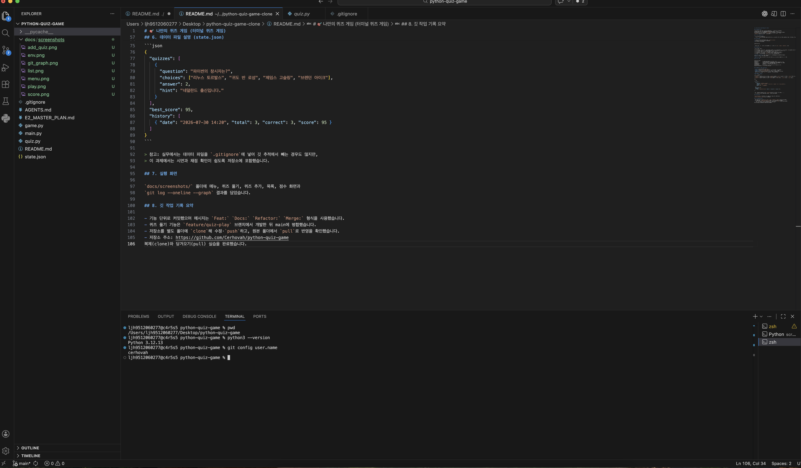
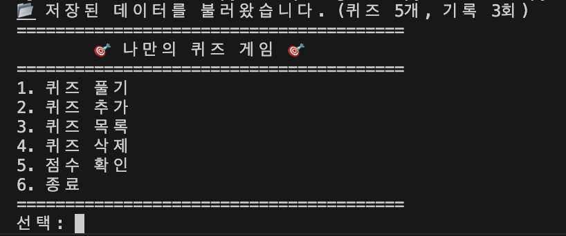
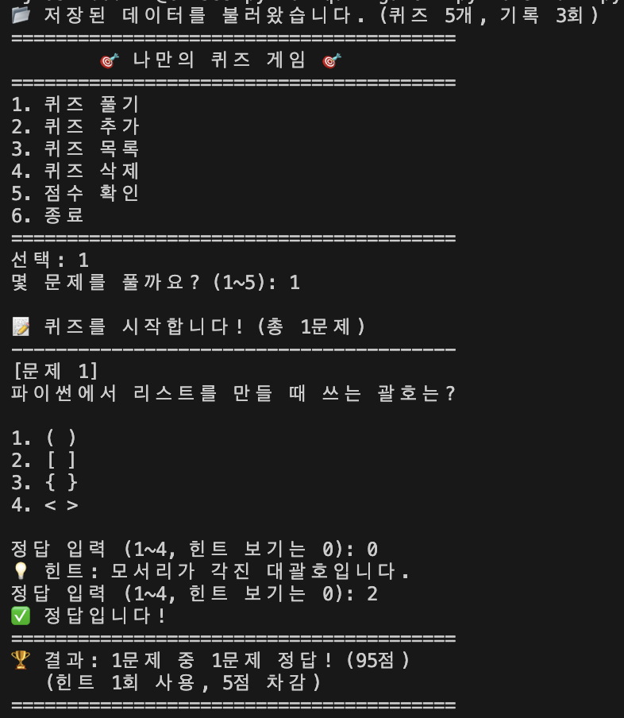
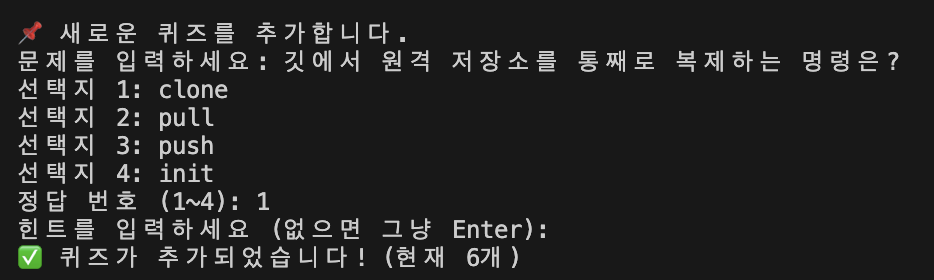
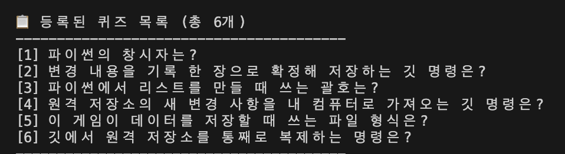
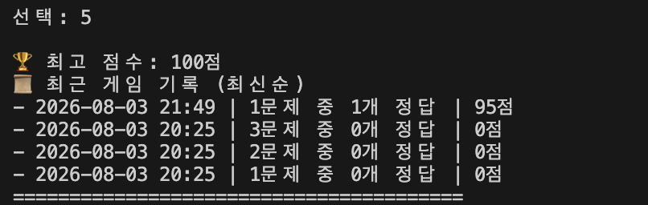
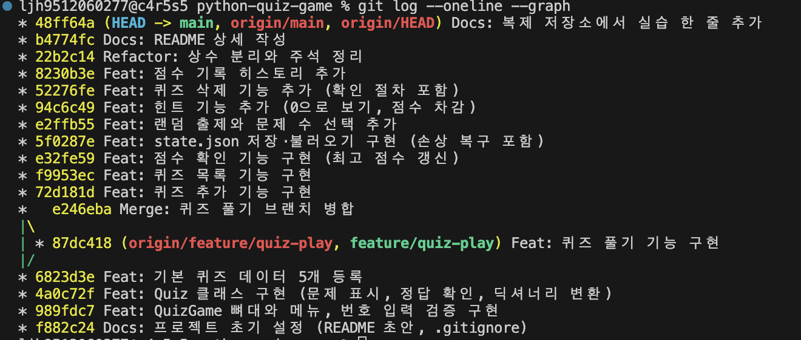

# 🎯 나만의 퀴즈 게임

Python과 Git의 기초를 실제 프로그램으로 익히기 위해 만든 퀴즈 게임입니다.
과제 제출 기준을 만족하는 **터미널 버전**을 먼저 완성한 뒤, 같은 게임 규칙을
더 직관적으로 사용할 수 있도록 **PySide6 GUI 확장판**까지 개발했습니다.

> **브랜치 안내**
>
> - <code>main</code>: 과제 제출용 터미널 프로그램과 전체 기술 문서
> - <code>feature/gui-version</code>: GUI 소스, 자동 테스트, macOS Intel 실행본과 GUI 화면
>
> GUI는 보너스 5종과 별개로 진행한 개인 확장 과제입니다. GUI 코드는
> <code>main</code>에 병합하지 않았으므로, 아래 GUI 링크는 모두
> <code>feature/gui-version</code> 브랜치의 실제 파일을 가리킵니다.

[GUI 확장 브랜치](https://github.com/Cerhovah/python-quiz-game/tree/feature/gui-version)
· [GUI 소스](https://github.com/Cerhovah/python-quiz-game/tree/feature/gui-version/gui)
· [macOS Intel 실행본](https://github.com/Cerhovah/python-quiz-game/blob/feature/gui-version/release/QuizGameGUI-macOS-Intel.zip)
· [GUI 전용 안내서](https://github.com/Cerhovah/python-quiz-game/blob/feature/gui-version/gui/README.md)

---

## 1. 프로젝트 개요와 의도

### 퀴즈 주제

- **주제:** Python과 Git 기초 상식
- **선정 이유:** 코디세이 과정에서 게임을 플레이하는 것만으로도 매주 보는
  시험 범위를 자연스럽게 복습할 수 있도록 학습 내용 자체를 퀴즈 주제로 골랐습니다.
  단순히 정답을 외우는 데 그치지 않고, 직접 프로그램을 만들고 다시 플레이하면서
  Python 문법과 Git 명령의 쓰임을 함께 기억하는 것이 목표입니다.

### GUI를 별도 확장 과제로 추가한 이유

터미널 버전만으로도 필수 기능과 보너스 5종은 모두 충족합니다. 그럼에도 GUI를
추가한 이유는 **개인적으로 사용자 친화적인 경험을 구현하는 것이 모든 프로그램의
의무라고 생각하기 때문**입니다. 기능이 존재하는 것만으로 끝나는 것이 아니라,
처음 사용하는 사람도 메뉴를 발견하고 현재 상태를 이해하며 실수 없이 조작할 수
있어야 좋은 프로그램이라고 생각했습니다.

이 의도를 화면에 다음과 같이 반영했습니다.

- 번호를 외워 입력하는 대신 사이드바와 버튼으로 기능을 찾을 수 있게 했습니다.
- 문제 진행률, 선택 상태, 정답·오답과 힌트 차감을 즉시 보여 줍니다.
- 삭제 전 확인 대화상자와 저장 상태 안내로 실수를 줄였습니다.
- 최고 점수와 최근 기록을 카드와 표로 구분해 한눈에 확인할 수 있게 했습니다.
- 터미널판의 게임 규칙과 JSON 구조는 그대로 유지해 두 버전의 결과가 달라지지 않게 했습니다.

### GUI 확장판 미리 보기

아래 이미지는 GUI 브랜치에서 실행해 자동 촬영한 실제 홈 화면입니다.
이미지를 누르면 브랜치의 원본 파일로 이동합니다.

GUI 홈 화면 — <code>feature/gui-version</code> 브랜치에서 확인 가능

---

## 2. 두 버전의 관계

| 구분 | 터미널 기본 완성판 | GUI 확장판 |
|---|---|---|
| 위치 | <code>main</code> | <code>feature/gui-version</code> |
| 목적 | Python·Git 기초 과제와 보너스 5종 충족 | 사용자 친화적인 데스크톱 경험 학습 |
| 화면 | <code>input()</code>과 <code>print()</code> | PySide6 위젯과 클릭 이벤트 |
| 핵심 클래스 | <code>Quiz</code>, <code>QuizGame</code> | 기존 <code>Quiz</code> 재사용 + <code>QuizRepository</code>, <code>QuizSession</code>, <code>QuizGameWindow</code> |
| 데이터 | 프로젝트 루트의 <code>state.json</code> | 같은 JSON 스키마 사용 |
| 설치 | 외부 라이브러리 없음 | 실행본은 설치 없음, 소스 실행은 PySide6 필요 |
| 실행 환경 | Python 3.10 이상 | macOS Intel 실행본 또는 Python 3.10 이상 |

GUI 브랜치는 과제 제출본의 마지막 커밋 <code>a49f1c5</code>에서 갈라졌습니다.
따라서 <code>main</code>의 터미널 프로그램을 그대로 보존하면서 GUI만 독립적으로
개발하고 검증할 수 있습니다.

~~~text
main
└── a49f1c5  터미널 과제 완성본
    └── README 기술 문서 보강

feature/gui-version
└── a49f1c5
    ├── efce360  GUI 소스·핵심 로직·테스트
    ├── fc4abd8  macOS Intel 실행본
    └── c933306  GUI 실행 화면
~~~

---

## 3. 실행 방법

### 3-1. 터미널 버전

요구 사항은 Python 3.10 이상입니다. 프로젝트 루트에서 실행합니다.

~~~bash
python3 --version
python3 main.py
~~~

터미널 버전은 Python 표준 라이브러리인 <code>json</code>,
<code>random</code>, <code>datetime</code>만 사용하므로 별도 설치가 필요하지 않습니다.

### 3-2. GUI 실행본 — 공용 Intel iMac에서 가장 쉬운 방법

1. [QuizGameGUI-macOS-Intel.zip](https://github.com/Cerhovah/python-quiz-game/blob/feature/gui-version/release/QuizGameGUI-macOS-Intel.zip)을 내려받습니다.
2. ZIP 압축을 풉니다.
3. <code>QuizGameGUI.app</code>을 더블 클릭합니다.
4. macOS가 처음 실행을 확인하면 앱을 우클릭하고 **열기**를 선택합니다.

실행본은 Python과 PySide6를 앱 안에 묶었기 때문에 관리자 권한이나 별도 라이브러리
설치가 필요하지 않습니다. 이 실행본은 공용 iMac 환경에 맞춘
**macOS Intel(x86_64)용**입니다. 교육용으로 직접 패키징한 비공증 앱이므로
최초 실행 시 macOS 확인 창이 나타날 수 있습니다.

압축을 푼 폴더에서 앱과 나란히 있는 <code>state.json</code>이 GUI 데이터 파일입니다.

### 3-3. GUI를 소스로 실행하는 방법

먼저 GUI 브랜치로 이동한 뒤, 관리자 권한이 필요 없는 가상환경을 사용합니다.

~~~bash
git checkout feature/gui-version
python3 -m venv .gui-venv
source .gui-venv/bin/activate
python -m pip install PySide6
python -m gui.app
~~~

가상환경은 이 프로젝트만의 독립된 라이브러리 공간입니다.
<code>.gui-venv</code>는 개인 실행 환경이므로 Git 커밋에 포함하지 않습니다.

---

## 4. 기능 목록

기능명에는 줄바꿈 방지 문자를 적용해 좁은 화면에서도 “퀴즈 풀/기”처럼
단어가 중간에서 갈라지지 않도록 보강했습니다.

| 메뉴·기능 | 공통 동작 | GUI에서의 표현 |
|---|---|---|
| **1 · 퀴&#8288;즈&nbsp;풀&#8288;기** | 풀 문제 수를 선택하면 겹치지 않게 무작위 출제합니다. 힌트 1회당 5점을 차감하고 정오·최종 점수·최고 점수·기록을 저장합니다. | 문제 수 선택기, 진행률 막대, 선택지 버튼, 힌트와 결과 카드 |
| **2 · 퀴&#8288;즈&nbsp;추&#8288;가** | 문제, 선택지 4개, 정답 번호와 선택적 힌트를 검증한 뒤 파일에 저장합니다. | 입력칸, 정답 선택 상자, 저장 완료 안내 |
| **3 · 퀴&#8288;즈&nbsp;목&#8288;록** | 등록된 문제를 번호와 함께 보여 주되 학습 전 정답은 노출하지 않습니다. | 스크롤 가능한 문제 목록 |
| **4 · 퀴&#8288;즈&nbsp;삭&#8288;제** | 번호를 고르고 확인한 경우에만 삭제하며 즉시 JSON에 반영합니다. | 항목 선택 후 활성화되는 삭제 버튼과 확인 대화상자 |
| **5 · 점&#8288;수&nbsp;확&#8288;인** | 최고 점수와 최근 게임 기록 5개를 최신순으로 표시합니다. | 최고 점수 카드와 날짜·문제 수·정답·점수 표 |
| **6 · 종&#8288;료** | 최신 상태를 저장하고 안전하게 종료합니다. 터미널의 <code>Ctrl+C</code>와 GUI 창 닫기도 저장과 연결됩니다. | “안전하게 저장하고 종료” 버튼 |

### 공통 입력과 점수 규칙

- 앞뒤 공백을 제거합니다.
- 빈 입력, 숫자가 아닌 입력, 범위 밖 숫자는 안내 후 다시 입력받습니다.
- 힌트가 없는 문제에서 힌트를 요청하면 점수를 차감하지 않습니다.
- 삭제는 사용자가 명확하게 확인한 경우에만 수행합니다.
- 점수는 아래 식으로 계산하며 최저 점수는 0점입니다.

~~~text
점수 = 반올림(맞힌 수 ÷ 푼 문제 수 × 100) − (힌트 사용 횟수 × 5)
~~~

---

## 5. 전체 개발 과정과 Codex 활용

이 프로젝트에서는 Codex를 단순 코드 생성기가 아니라 **명세를 지키는 짝 프로그래머와
검수 도구**로 활용했습니다. 사용자가 기능 문구, 퀴즈 내용, 브랜치 전략과 최종 판단을
결정하고 Git 명령을 직접 실행했으며, Codex는 설계도 대조, 전체 파일 작성, 오류 분석,
테스트와 패키징 검증을 담당했습니다.

| 과정 | 개발 내용 | 의도와 검증 |
|---|---|---|
| 0~1단계 | 공용 Mac 환경 점검, 저장소 초기화, 규칙·설계 문서와 첫 파일 기록 | 작업 위치·Python·Git·계정을 먼저 확인하고 공용 컴퓨터의 인증 정보 저장을 막음 |
| 2~4단계 | 메뉴와 입력 검증, <code>Quiz</code> 클래스, 승인된 기본 퀴즈 5개 | 작은 골격부터 실행하며 객체와 데이터의 역할을 분리 |
| 5단계 | <code>feature/quiz-play</code>에서 퀴즈 풀기 개발 후 <code>--no-ff</code> 병합 | 기능 브랜치가 실제로 갈라졌다 합쳐진 기록을 남김 |
| 6~9단계 | 추가·목록·최고 점수·JSON 저장과 손상 복구 | 기능을 하나씩 연결하고 재실행 후에도 데이터가 유지되는지 확인 |
| 10~13단계 | 랜덤 출제, 문제 수 선택, 힌트, 삭제, 기록 히스토리 | 요구된 보너스 5종을 모두 독립적으로 검수 |
| 14단계 | 상수 분리, 한국어 주석과 README 정리 | 동작을 바꾸지 않는 리팩터링과 문서화를 구분 |
| 15단계 | 별도 폴더 <code>clone</code> → 수정·<code>push</code> → 원본에서 <code>pull</code> | 원격 저장소를 통한 협업 흐름을 실제로 재현 |
| 16단계 | 실행 화면 7장과 Git 그래프 정리 | 제출자가 코드뿐 아니라 실행과 이력을 바로 확인하도록 증거를 남김 |
| GUI 확장 | 환경 조사, PySide6 UI, 로직 분리, 자동 테스트, macOS 앱 패키징 | 과제 완성본을 보존한 채 사용자 경험을 별도 브랜치에서 확장 |

### Codex와 작업할 때 적용한 통제 방법

1. 매 작업 전 <code>AGENTS.md</code>와 <code>E2_MASTER_PLAN.md</code>의 명세를 확인했습니다.
2. 한 번에 한 단계만 진행하고, 대상 파일은 해당 단계의 완성 상태로 전체 작성했습니다.
3. 기본 퀴즈 문구는 사용자가 표로 검토하고 승인한 뒤에만 코드에 반영했습니다.
4. 브랜치 이동·커밋·푸시·병합·클론·풀은 사용자가 직접 실행했습니다.
5. Codex는 매 단계 문법 검사와 실행 시험 결과를 확인하고 커밋 직전에 멈췄습니다.
6. GUI에서도 화면 코드와 게임 규칙을 분리하고, 수동 확인만이 아니라 자동 테스트를 추가했습니다.
7. GUI 실행본은 임시 가상환경에서 빌드해 공용 Mac과 저장소에 불필요한 설치 파일을 남기지 않았습니다.

이 방식의 핵심은 “AI가 만든 결과를 바로 믿는 것”이 아니라,
**명세 → 작은 구현 → 실행 → 검수 → 사용자 커밋**의 순서를 반복한 것입니다.

### 개발 환경 화면

VS Code 프로젝트 구조와 Python·Git 사용자 확인 화면

---

## 6. 코드 구조와 설계

### 6-1. 터미널 기본판

~~~text
main.py
  └── QuizGame 객체 생성과 실행

game.py
  ├── 메뉴와 입력 검증
  ├── 퀴즈 풀기·추가·목록·삭제
  ├── 점수와 최근 기록
  └── state.json 저장·불러오기

quiz.py
  └── Quiz 한 문제의 속성·출력·채점·딕셔너리 변환
~~~

- <code>Quiz</code>는 문제 하나의 데이터와 정답 확인 규칙을 맡습니다.
- <code>QuizGame</code>은 메뉴, 게임 흐름, 점수와 저장을 맡습니다.
- <code>main.py</code>는 객체를 만들고 실행하는 시작점 역할만 합니다.

### 6-2. GUI 확장판

GUI는 화면과 게임 규칙을 한 파일에 섞지 않았습니다.

~~~mermaid
flowchart LR
    U[사용자 클릭] --> A[gui/app.py QuizGameWindow]
    A --> S[QuizSession 한 판의 진행과 점수]
    A --> R[QuizRepository 검증·저장·불러오기]
    S --> Q[quiz.py Quiz]
    R --> Q
    R <--> J[(state.json)]
~~~

| GUI 파일 | 역할 |
|---|---|
| [<code>gui/app.py</code>](https://github.com/Cerhovah/python-quiz-game/blob/feature/gui-version/gui/app.py) | 창, 페이지, 위젯, 레이아웃, 클릭 신호와 화면 갱신 |
| [<code>gui/core.py</code>](https://github.com/Cerhovah/python-quiz-game/blob/feature/gui-version/gui/core.py) | 데이터 검증, 무작위 세션, 힌트 차감, 점수·기록, JSON 저장 |
| [<code>gui/test_core.py</code>](https://github.com/Cerhovah/python-quiz-game/blob/feature/gui-version/gui/test_core.py) | 저장소와 게임 규칙 자동 테스트 8개 |
| [<code>gui/test_gui.py</code>](https://github.com/Cerhovah/python-quiz-game/blob/feature/gui-version/gui/test_gui.py) | 실제 위젯 클릭 흐름 자동 테스트 4개 |
| 프로젝트의 <code>quiz.py</code> | 기존 <code>Quiz</code> 클래스를 GUI에서도 재사용 |

### 6-3. 위젯·레이아웃·클릭 신호

- **위젯(widget):** 라벨, 버튼, 입력칸, 목록과 표처럼 화면에 보이는 부품입니다.
- **레이아웃(layout):** 위젯의 가로·세로·격자 배치를 관리하는 보이지 않는 정리 상자입니다.
- **신호 연결(signal/slot):** 버튼에서 “클릭됨”이라는 신호가 오면 지정한 메서드를 실행합니다.

~~~python
start_button.clicked.connect(self.start_quiz)
~~~

위 코드는 “시작 버튼을 클릭하면 <code>start_quiz</code> 메서드를 실행하라”는 뜻입니다.
GUI에서는 <code>QStackedWidget</code>으로 홈·풀기·추가·목록·삭제·점수 화면을
한 창 안에서 전환하고, <code>QVBoxLayout</code>, <code>QHBoxLayout</code>,
<code>QGridLayout</code>으로 화면 크기가 달라도 정돈된 배치를 유지합니다.

---

## 7. 파일 구조

<code>main</code>에는 과제 제출 파일이 있고, 아래에서 “GUI 브랜치 전용”이라고 표시한
항목은 <code>feature/gui-version</code>에서만 확인할 수 있습니다.

~~~text
python-quiz-game/
├── main.py
├── quiz.py
├── game.py
├── state.json
├── README.md
├── .gitignore
├── AGENTS.md
├── E2_MASTER_PLAN.md
├── docs/
│   └── screenshots/
│       ├── env.png
│       ├── menu.png
│       ├── play.png
│       ├── add_quiz.png
│       ├── list.png
│       ├── score.png
│       ├── git_graph.png
│       └── gui_home.png              # GUI 브랜치 전용
├── gui/                              # GUI 브랜치 전용
│   ├── __init__.py
│   ├── app.py
│   ├── core.py
│   ├── test_core.py
│   ├── test_gui.py
│   └── README.md
└── release/                          # GUI 브랜치 전용
    └── QuizGameGUI-macOS-Intel.zip
~~~

---

## 8. 데이터 파일 설명

### 역할과 안전 장치

- **경로:** 터미널판은 프로젝트 루트, GUI 실행본은 앱과 같은 폴더의 <code>state.json</code>
- **역할:** 퀴즈 목록, 최고 점수와 게임 기록을 재실행 후에도 유지
- **인코딩:** UTF-8, <code>ensure_ascii=False</code>로 한글을 읽을 수 있게 저장
- **첫 실행:** 파일이 없으면 승인된 기본 퀴즈 5개로 시작
- **손상 복구:** JSON 구조가 잘못되면 안내 후 기본 퀴즈로 안전하게 복구
- **종료 저장:** 정상 종료, 입력 중단, GUI 창 닫기에서 최신 상태 저장

### JSON 스키마

| 열쇠 | 자료형 | 뜻 |
|---|---|---|
| <code>quizzes</code> | 리스트 | 퀴즈 딕셔너리 목록 |
| <code>question</code> | 문자열 | 문제 내용 |
| <code>choices</code> | 문자열 4개 리스트 | 선택지 |
| <code>answer</code> | 정수 1~4 | 정답 번호 |
| <code>hint</code> | 문자열 또는 <code>null</code> | 선택적 힌트 |
| <code>best_score</code> | 정수 또는 <code>null</code> | 최고 점수, 아직 기록이 없으면 <code>null</code> |
| <code>history</code> | 리스트 | 날짜·문제 수·정답 수·점수를 담은 게임 기록 |

~~~json
{
  "quizzes": [
    {
      "question": "파이썬의 창시자는?",
      "choices": ["리누스 토르발스", "귀도 반 로섬", "제임스 고슬링", "브렌던 아이크"],
      "answer": 2,
      "hint": "네덜란드 출신입니다."
    }
  ],
  "best_score": 95,
  "history": [
    {
      "date": "2026-07-30 14:20",
      "total": 3,
      "correct": 3,
      "score": 95
    }
  ]
}
~~~

> 실무에서는 사용자 데이터 파일을 Git 추적에서 제외하는 경우도 많습니다.
> 이 과제에서는 시연과 채점자가 저장 구조를 바로 확인할 수 있도록 저장소에 포함했습니다.

---

## 9. 테스트와 검증

### 터미널판 검수

- Python 문법 검사: <code>python3 -m py_compile main.py quiz.py game.py</code>
- 빈 입력, 문자 입력과 범위 밖 숫자의 재입력 처리
- 문제 수 선택과 겹치지 않는 무작위 출제
- 힌트 표시, 힌트 없음 처리와 5점 차감
- 정답·오답, 최저 0점, 최고 점수 갱신
- 퀴즈 추가·목록·삭제 확인과 저장 반영
- 최근 기록 5개 최신순 표시
- 종료 후 재실행 데이터 유지
- 파일 없음과 손상된 JSON 복구
- <code>Ctrl+C</code> 입력 중단 시 저장 후 안전 종료

### GUI 자동 테스트 — GUI 브랜치에서 실행

개발 환경에서 Python 3.12.13, PySide6 6.11.1과 PyInstaller 6.21.0을 사용했습니다.

~~~bash
git checkout feature/gui-version
source .gui-venv/bin/activate
QT_QPA_PLATFORM=offscreen python -m unittest gui.test_core gui.test_gui -v
QT_QPA_PLATFORM=offscreen python -m gui.app --smoke-test
~~~

총 **12개 자동 테스트**를 통과했습니다.

- 핵심 로직 8개: 기본 데이터, 추가·저장·재불러오기·삭제, 손상 복구,
  한글 JSON, 빈 선택지 거부, 힌트 점수, 힌트 없음, 문제 수 범위
- GUI 상호작용 4개: 페이지 이동, 힌트·정답·결과 흐름, 추가 버튼 저장,
  삭제 확인 대화상자와 저장

### 실행본 검증

- PyInstaller로 <code>QuizGameGUI.app</code> 생성
- 실행 파일이 Mach-O 64-bit x86_64인지 확인
- <code>codesign --verify --deep --strict</code> 검증 통과
- 패키징된 앱의 실제 실행과 GUI 스모크 테스트 통과
- 최종 ZIP 압축 무결성 검사 통과
- 압축을 다시 푼 앱에서도 실행 시험 통과

---

## 10. 실행 화면

스크린샷은 단순 파일 목록으로 두지 않고, 기능 흐름에 맞게 배치했습니다.

### 메뉴와 퀴즈 풀기

<table>
  <tr>
    <td width="50%" valign="top">
       
      전체 기능으로 이동하는 메인 메뉴
    </td>
    <td width="50%" valign="top">
       
      힌트 사용, 정답 확인과 5점 차감 결과
    </td>
  </tr>
</table>

### 퀴즈 추가와 목록

<table>
  <tr>
    <td width="50%" valign="top">
       
      문제·선택지·정답을 입력해 새 퀴즈 저장
    </td>
    <td width="50%" valign="top">
       
      정답을 노출하지 않는 등록 문제 목록
    </td>
  </tr>
</table>

### 점수 기록과 Git 작업 그래프

<table>
  <tr>
    <td width="50%" valign="top">
       
      최고 점수와 최근 게임 기록
    </td>
    <td width="50%" valign="top">
       
      <code>feature/quiz-play</code>의 분기와 <code>--no-ff</code> 병합 기록
    </td>
  </tr>
</table>

---

## 11. Git 작업 기록

### 과제 제출본 18개 커밋

기능 단위 커밋 전체 보기

1. <code>Docs: 프로젝트 초기 설정 (README 초안, .gitignore)</code>
2. <code>Feat: QuizGame 뼈대와 메뉴, 번호 입력 검증 구현</code>
3. <code>Feat: Quiz 클래스 구현 (문제 표시, 정답 확인, 딕셔너리 변환)</code>
4. <code>Feat: 기본 퀴즈 데이터 5개 등록</code>
5. <code>Feat: 퀴즈 풀기 기능 구현</code>
6. <code>Merge: 퀴즈 풀기 브랜치 병합</code>
7. <code>Feat: 퀴즈 추가 기능 구현</code>
8. <code>Feat: 퀴즈 목록 기능 구현</code>
9. <code>Feat: 점수 확인 기능 구현 (최고 점수 갱신)</code>
10. <code>Feat: state.json 저장·불러오기 구현 (손상 복구 포함)</code>
11. <code>Feat: 랜덤 출제와 문제 수 선택 추가</code>
12. <code>Feat: 힌트 기능 추가 (0으로 보기, 점수 차감)</code>
13. <code>Feat: 퀴즈 삭제 기능 추가 (확인 절차 포함)</code>
14. <code>Feat: 점수 기록 히스토리 추가</code>
15. <code>Refactor: 상수 분리와 주석 정리</code>
16. <code>Docs: README 상세 작성</code>
17. <code>Docs: 복제 저장소에서 실습 한 줄 추가</code>
18. <code>Docs: 실행 스크린샷 추가</code>

### 실제로 연습한 Git 흐름

- <code>init</code>, <code>add</code>, <code>commit</code>, <code>push</code>로 저장소를 시작했습니다.
- <code>feature/quiz-play</code>에서 기능을 개발하고 <code>--no-ff</code>로 <code>main</code>에 병합했습니다.
- 별도 폴더로 저장소를 <code>clone</code>한 뒤 수정·<code>push</code>했습니다.
- 원본 폴더에서 <code>pull</code>하여 원격 변경이 반영되는 것을 확인했습니다.
- 과제 완성 후 <code>feature/gui-version</code>을 만들어 GUI를 독립적으로 개발하고 푸시했습니다.
- GUI 브랜치는 <code>main</code>에 병합하지 않아 과제 코드와 확장판을 분리했습니다.

---

## 12. 이 프로젝트에서 확인할 수 있는 학습 내용

| 학습 주제 | 코드에서 확인할 위치 |
|---|---|
| 변수와 <code>int</code>·<code>str</code>·<code>bool</code>·<code>list</code>·<code>dict</code> | 정답 번호, 문제 문장, 채점 결과, 퀴즈 목록, JSON 딕셔너리 |
| <code>if / elif / else</code> | 메뉴 분기, 정오 판정, 최고 점수 갱신 |
| <code>for</code>와 <code>while</code> | 정해진 문제·선택지 반복과 올바른 입력까지의 반복 |
| 함수·매개변수·반환값 | 숫자 입력 검증, 정답 확인, 딕셔너리 변환 |
| 클래스·객체·<code>self</code>·<code>__init__</code> | <code>Quiz</code>, <code>QuizGame</code>과 GUI 확장 클래스 |
| 파일 입출력과 JSON | <code>save_state</code>, <code>load_state</code>, <code>QuizRepository</code> |
| <code>try/except</code> | 입력 변환 실패, 파일 없음·손상·저장 실패 처리 |
| GUI 기초 | 위젯, 레이아웃, 클릭 신호, 화면 전환과 상태 갱신 |
| Git 기초 | 커밋 18개, 기능 브랜치 병합, clone·push·pull, GUI 브랜치 분리 |

---

## 13. 저장소와 확장판 확인

- 저장소: https://github.com/Cerhovah/python-quiz-game
- 과제 제출·기술 문서: [<code>main</code>](https://github.com/Cerhovah/python-quiz-game/tree/main)
- GUI 확장판: [<code>feature/gui-version</code>](https://github.com/Cerhovah/python-quiz-game/tree/feature/gui-version)
- GUI 실행본: [<code>QuizGameGUI-macOS-Intel.zip</code>](https://github.com/Cerhovah/python-quiz-game/blob/feature/gui-version/release/QuizGameGUI-macOS-Intel.zip)

GUI는 과제 필수·보너스 범위를 줄이거나 대체한 것이 아니라, 완성된 터미널판 위에
사용자 경험과 배포 과정을 추가로 학습하기 위해 만든 독립 확장판입니다.
