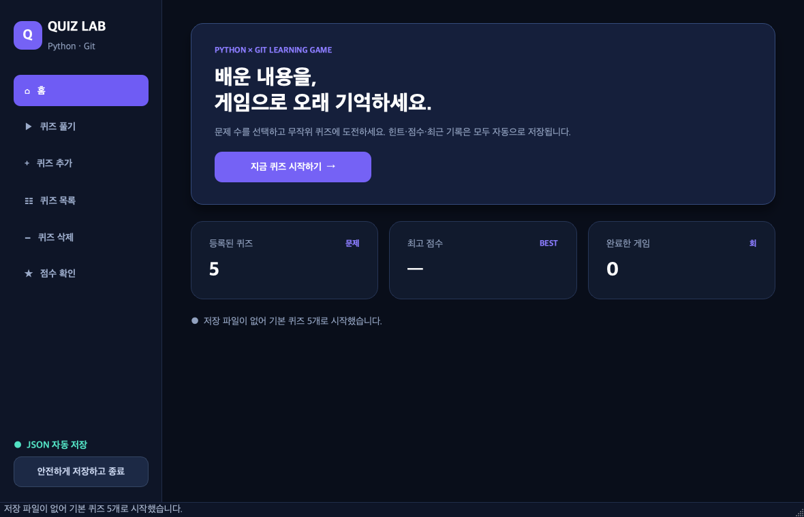

# 🎯 나만의 퀴즈 게임 — GUI 확장판

이 브랜치는 완성된 터미널 퀴즈 게임을 `PySide6` 데스크톱 화면으로 확장한 버전입니다.
과제 원본과 전체 개발 기록은 아래 `main` 브랜치를 기준 문서로 사용합니다.

> **기준 프로젝트:** [터미널 퀴즈 게임 (`main` 브랜치)](https://github.com/Cerhovah/python-quiz-game/tree/main)



## 바로 실행하기

macOS Intel용 실행본은 [`release/QuizGameGUI-macOS-Intel.zip`](release/QuizGameGUI-macOS-Intel.zip)에 있습니다.

1. ZIP 파일을 내려받아 압축을 풉니다.
2. 압축을 푼 폴더의 `QuizGameGUI.app`을 더블 클릭합니다.
3. 같은 폴더의 `state.json`에 퀴즈와 점수 기록이 저장됩니다.

처음 실행할 때 macOS 보안 경고가 나오면 앱을 우클릭하고 **열기**를 선택합니다.
이 실행본은 별도 개발자 서명을 하지 않은 학습용 앱입니다.

## 소스로 실행하기

Python 3.10 이상이 필요합니다. 프로젝트 루트에서 다음 명령을 순서대로 실행합니다.

```bash
python3 -m venv .gui-venv
source .gui-venv/bin/activate
python -m pip install PySide6
python -m gui.app
```

기존 터미널 버전은 이 브랜치에서도 `python3 main.py`로 실행할 수 있습니다.

## 제공 기능

- 문제 수 선택과 겹치지 않는 무작위 출제
- 선택지 버튼 채점, 힌트 보기와 점수 차감
- 퀴즈 추가·목록·삭제
- 최고 점수와 최근 게임 기록
- UTF-8 `state.json` 저장·불러오기와 손상 복구

## 구조와 문서

- `gui/app.py`: PySide6 창, 화면 구성, 버튼 동작
- `gui/core.py`: 퀴즈 규칙, 점수 계산, JSON 저장
- `gui/test_core.py`: 핵심 로직 자동 테스트
- `gui/test_gui.py`: 실제 위젯 상호작용 자동 테스트
- [`gui/README.md`](gui/README.md): GUI 구현과 학습 포인트 상세 설명
- [`main` 브랜치 README](https://github.com/Cerhovah/python-quiz-game/blob/main/README.md): 터미널 원본의 기능·구조·Git 작업 기록

GUI는 원본 과제의 선택적 확장판입니다. 기능 명세와 제출 기준의 단일 기준 문서는
`main` 브랜치 README이며, 이 문서는 GUI 실행과 유지보수에 필요한 정보만 관리합니다.

## 테스트

PySide6가 설치된 가상환경에서 다음 명령으로 핵심 로직과 화면 상호작용을 함께 검사합니다.

```bash
QT_QPA_PLATFORM=offscreen python -m unittest gui.test_core gui.test_gui -v
```
